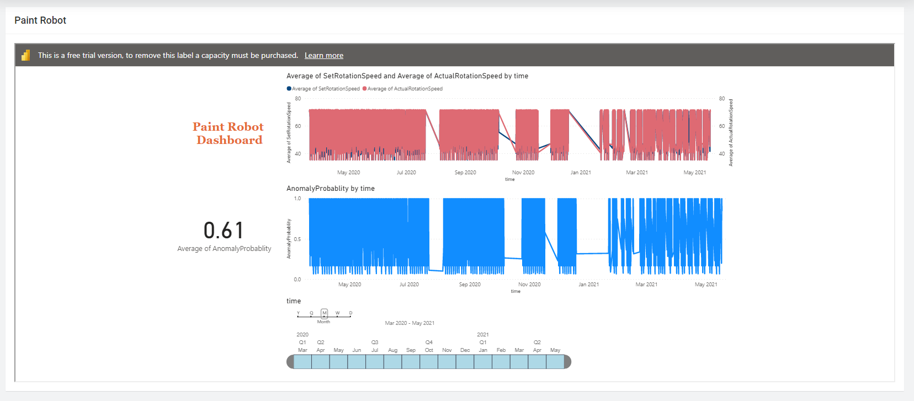
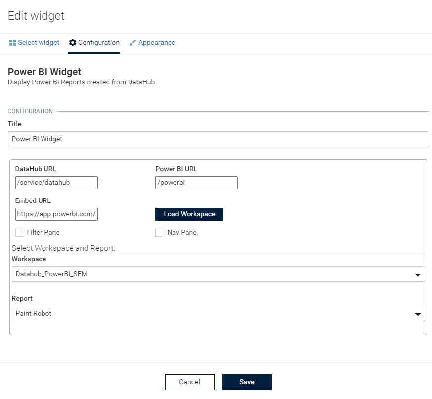

# Power BI Widget for Cumulocity 

This Power BI widget is the Cumulocity module federation plugin created using c8ycli. This plugin can be used in Application Builder or Cockpit. The Power BI widget helps you to display reports created from data offloaded from DataHub seamlessly in application.

### Please choose Power BI release based on Cumulocity/Application builder version:

| APPLICATION BUILDER | CUMULOCITY | POWER BI WIDGET  |
|---------------------|------------|------------------|
| 2.x.x               | >= 1016.x.x| 1.x.x            | 
|                     | >= 1018.x.x| 2.x.x            |

## Features

  
*  **DataHub Integration :** Seamless data visualization from DataHub using PowerBI workspace and report selection.

*  **PowerBI Configuration:** Ability to configure various PowerBI report options.

*  **Workspace Selection:** Ability to select the workspace.

*  **Reports:** Select the respective report from list of available reports under the workspace selected.

## Prerequisite
   * DataHub should be subscribed, configured and installed in the tenant.
   * Reports should be created in PowerBI and you should have connection for PowerBI configured in DataHub.

* Minimum Permission needed:
DataHub_Manager

* For more information on DataHub,click here:
https://cumulocity.com/guides/datahub/datahub-overview/ 

## Installation

### Runtime Widget Deployment?

* This widget support runtime deployment. Download [Runtime Binary](https://github.com/SoftwareAG/cumulocity-power-bi-widget-plugin/releases/download/1.0.2/sag-ps-pkg-powerbi-runtime-widget-1.0.2.zip) and install via Administrations --> Ecosystems --> Applications --> Packages.

## QuickStart

  

This guide will teach you how to add widget in your existing or new dashboard.

  

1. Open you application from App Switcher

  

2. Add new dashboard or navigate to existing dashboard

  

3. Click `Add Widget`

  

4. Search for `Power BI`

  

5. Select `Target Assets or Devices`

  

7. Click `Save`

  

Congratulations! Power BI widget is configured.

## User Guide

  

  

-  **DataHub URL :** User can specify DataHub URL if needed or use default.

-  **PowerBI URL :** User can specify Power BI URL if needed or use default.
-  **Embed URL :** User can specify Embed Report if needed(in case it has been updated on Power BI) or use default.

-  **Load Workspace :** In case user changes DataHub or Power BI URL then they need to click this button to make a call to power BI and get the workspace and reports available if any. If the path is wrong, error will be shown.
-  **Nav Pane :** To show Navigation Pane in Power BI Report or not. This comes from Power BI and is used if your workspace has more than one report in same page.
-  **Filter Pane :** To show the Filter Pane in Power BI report or not. This comes from Power BI and can be used to see runtime changes in report based on filter applied.

-  **Workspace :** Choose the workspace from dropdown list. Once selected, the reports dropdown is populated accordingly.

-  **Report :** Choose the report from dropdown list.

  

NOTE : By default, first workspace and first report under that workspace comes selected.

------------------------------

This widget is provided as-is and without warranty or support. They do not constitute part of the Cumulocity product suite. Users are free to use, fork and modify them, subject to the license agreement. While Cumulocity GmbH welcomes contributions, we cannot guarantee to include every contribution in the master project.
  

_____________________

  

